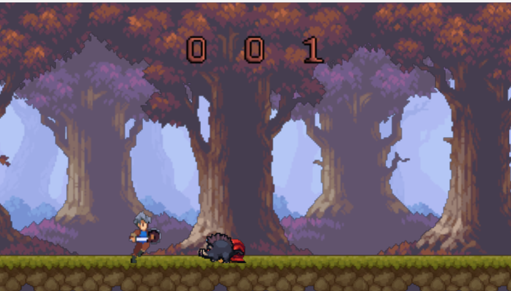
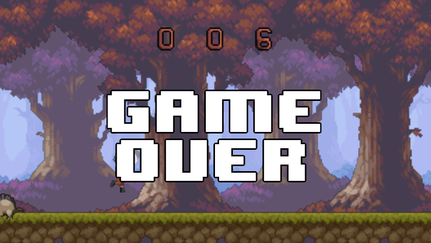

# golang-project

## Opis projektu

Celem projektu jest stworzenie prostej gry platformowej 2D przy użyciu języka Go w wersji 1.20 w połączeniu z OpenGL. Gra będzie zainspirowana grą [Google Chrome Dinosaur Game](https://chrome://dino/). W projekcie użyjemy wzorca architektnonicznego entity-component-system (ECS). Bazuje na podejściu zwanym kompozycją ponad dziedziczenie. ECS zapewnia izolację poszczególnych elementów, przejrzystość, modularność i łatwość rozszerzania kodu. W projekcie planujemy użyć następujących zewnętrznych bilbiotek:
- https://github.com/go-gl/gl
- https://github.com/go-gl/glfw
- https://github.com/go-gl/mathgl
 
## Zespół

- Michał Kacprzak
- Piotr Harmuszkiewicz

## Podział pracy

- Michał Kacprzak
  - stworzenie architektury realizującej wzorzec entity-component-system (ECS)
  - implementacja componentów związanych z:
    - poruszaniem się obiektu
    - pozycją obiektu
    - wielkością obiektu
  - implementacja systemów odpowiadających za:
    - poruszanie się obiektów
    - generowanie przeszkód
    - skakanie postaci
    - detekcje kolizji
    - zarządzaniem stanem gry - rozpoczynanie, resetowanie, śledzenie wyniku użytkownika
  - implementacja encji reprezentujących:
    - gracza
    - przeszkody
  - przygotowanie dokumentacji projektu
- Piotr Harmuszkiewicz
  - implementacja componentów związanych z:
    - wynikiem gry
    - kolicją obiektu
    - spritami obiektów
    - animacją obiektów
  - implementacja systemów odpowiadających za:
    - renderowanie obiektów
    - animacje obiektów
    - wyświetlaniem wyniku
    - wyświetlanie napisu "Game Over" w przypadku
    - generowanie przeszkód
    - zarządzaniem stanem gry - rozpoczynanie, resetowanie
  - przygotowanie spritów oraz shaderów używanych w projekcie
  - przygotowanie dokumentacji projektu

## Kompilacja
```shell
go mod tidy && go build && ./game2d
```
### Windows
 Biblioteki użyte w projekcie są stworzone w języku C i wymagają kompilator cgo (zwykle gcc). System Windows nie ma kompilatora gcc, więc, aby program poprawnie zadziałał, należy go zainstalować. Zalecamy użyć [tdm-gcc](https://jmeubank.github.io/tdm-gcc/): [link do pobrania](https://github.com/jmeubank/tdm-gcc/releases/download/v10.3.0-tdm64-2/tdm64-gcc-10.3.0-2.exe).
### Ubuntu/Debian
 Wymagany jest pakiet: **libgl1-mesa-dev**

## Sterowanie
### Esc - quit
### Space - jump
### Enter - restart after GameOver

## Wygląd gry





